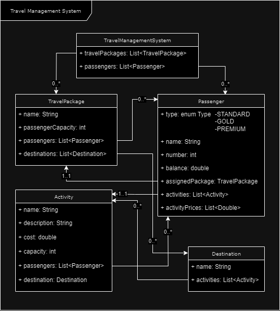

# Travel Management System

This Java-based Travel Management System is designed to assist travel agencies in managing their travel packages, itineraries, and passengers. The system incorporates a flexible structure to accommodate various passenger types and their specific requirements.

## Features

1. **Travel Package Management:**
    - Create and maintain travel packages with names, passenger capacities, itineraries, and passenger lists.
    - Print detailed itineraries, including destinations and available activities.

2. **Destination and Activity Management:**
    - Define destinations with associated activities.
    - Specify activities with names, descriptions, costs, and capacities.
    - Enroll passengers in activities and manage available spaces.

3. **Passenger Types:**
    - Standard passengers with balance deduction for activity enrollment.
    - Gold passengers with a 10% discount on activity costs.
    - Premium passengers with free activity enrollment.

4. **Passenger Management:**
    - Enroll passengers in travel packages and activities.
    - Print passenger lists, details, and enrolled activities.

5. **Unit Testing:**
    - Comprehensive JUnit test cases for each class and method.

## Implementation Details

### High Level Diagram

### Class Structure

- **TravelPackage:**
    - Attributes: Name, Passenger Capacity, Itinerary, Passengers
    - Methods: Print Itinerary, Print Passenger List, Enroll Passenger, Print Passenger Details, Print Available Activities

- **Destination:**
    - Attributes: Name, Activities
    - Methods: Add Activity

- **Activity:**
    - Attributes: Name, Description, Cost, Capacity, Enrolled Passengers
    - Methods: Add Enrolled Passenger, Print Activity Details, Is Space Available

- **Passenger:**
    - Attributes: Name, Passenger Number, Passenger Type, Balance, Enrolled Activities
    - Methods: Enroll for Activity, Print Passenger Details

### Unit Tests

- JUnit test cases covering all methods in each class.
